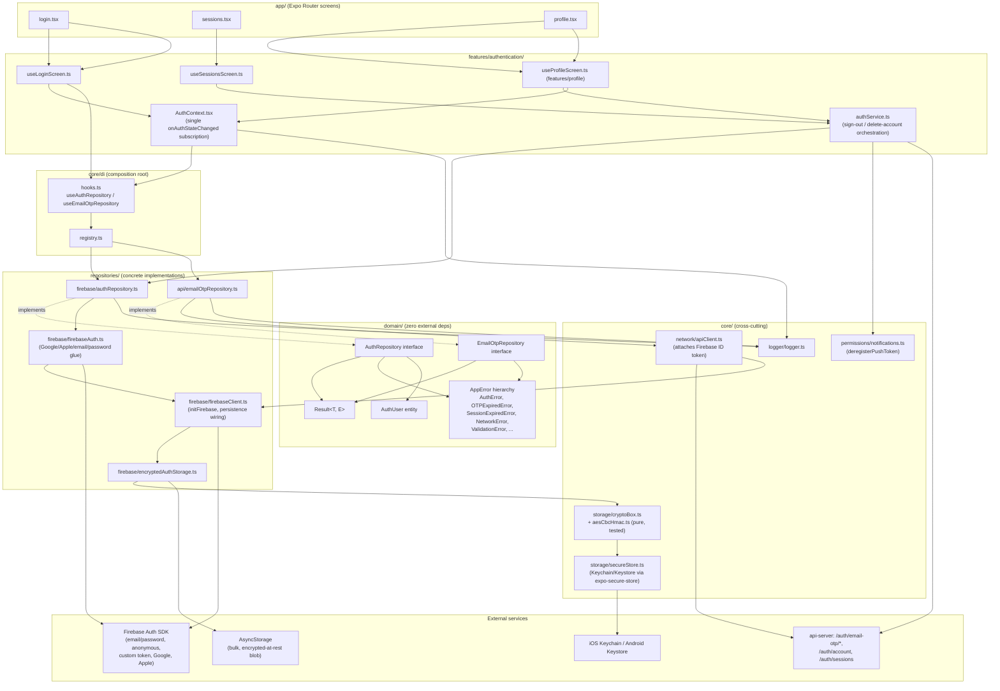

# 1. Authentication Architecture Diagram

## Layer rules this diagram enforces (checked by ESLint, see ADR 0001)

- `domain/` has zero outward dependencies — `AuthRepository`, `EmailOtpRepository`, `AuthUser`, and the whole `AppError`/`Result` vocabulary are pure TypeScript.
- `core/di` is the one place allowed to import concrete repository implementations (it's the composition root).
- `app/` and `features/` never call the Firebase SDK directly — the only two files that touch `repositories/firebase/firebaseClient.ts`'s `firebaseAuth` proxy outside of `repositories/` are `core/network/apiClient.ts` and `core/permissions/notifications.ts`, both with inline, justified `eslint-disable` comments (documented in `eslint.config.js`) because there's no domain-level indirection yet for "get the current auth token" / "read the current user for push-token registration."
- **One auth-state subscription.** Before this pass, `AuthContext`, `AppContext`, `LanguageContext`, and `app/_layout.tsx`'s `Gate` each ran their own independent `onAuthStateChanged` listener against the same Firebase instance. They now all derive from `AuthContext`'s single subscription (see the flow diagrams' "before/after" note and the technical debt report).
