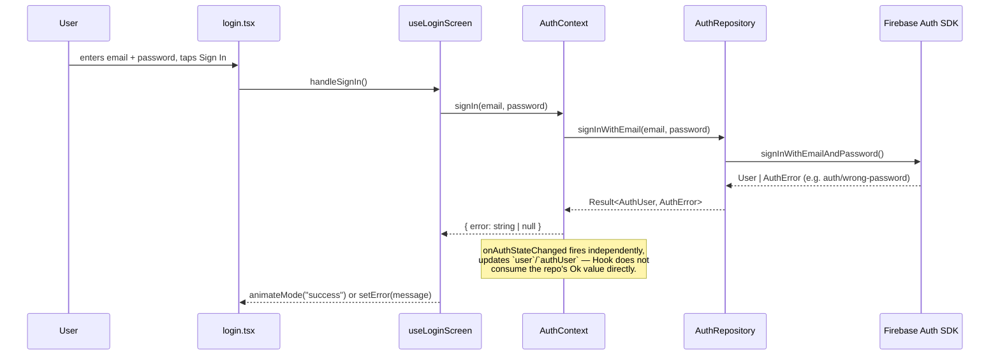
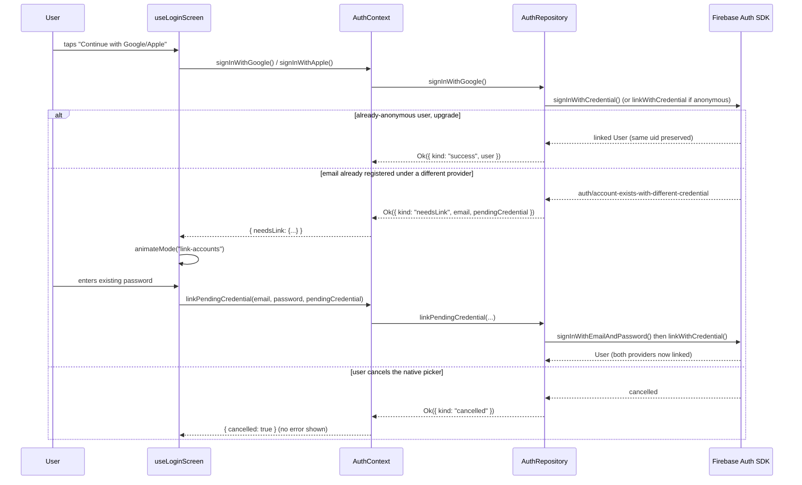
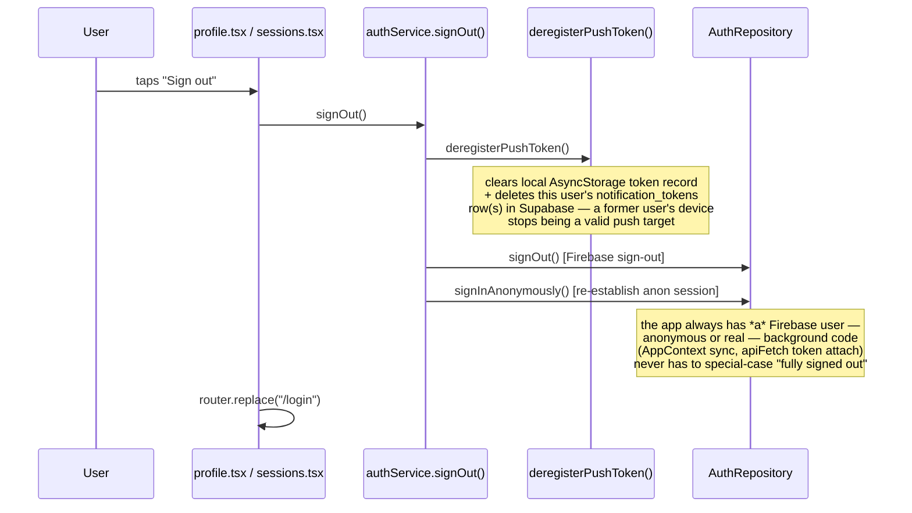

# 2. Authentication Flow Diagrams

## Email + password sign-in



## Email OTP sign-in (backend-mediated, no Firebase phone auth)

```mermaid
sequenceDiagram
    participant U as User
    participant Screen as login.tsx (OtpVerifyView)
    participant Hook as useLoginScreen
    participant OtpRepo as EmailOtpRepository
    participant Backend as api-server /auth/email-otp/*
    participant Ctx as AuthContext
    participant FB as Firebase Auth SDK

    U->>Screen: enters email, taps "Send code"
    Screen->>Hook: handleRequestOtp()
    Hook->>OtpRepo: requestCode(email)
    OtpRepo->>Backend: POST /auth/email-otp/request
    Note over Backend: rate-limited per-email (5/hr) and<br/>per-IP (20/hr); generates a 6-digit code,<br/>stores only its SHA-256 hash, 10 min TTL
    Backend-->>OtpRepo: { success: true } (same shape whether<br/>the email is registered or not)
    OtpRepo-->>Hook: Result<void, AppError>
    Hook->>Hook: setOtpCooldown(30) — resend disabled 30s
    Hook-->>Screen: animateMode("otp-verify")

    U->>Screen: enters 6-digit code (autofill-eligible), taps Verify
    Screen->>Hook: handleVerifyOtp() [guarded: no-op if already verifying]
    Hook->>OtpRepo: verifyCode(email, code)
    OtpRepo->>Backend: POST /auth/email-otp/verify
    alt correct code, not expired
        Note over Backend: code deleted immediately (one-time use)
        Backend-->>OtpRepo: { customToken }
        OtpRepo-->>Hook: Result.Ok({ customToken })
        Hook->>Ctx: signInWithCustomToken(customToken)
        Ctx->>FB: signInWithCustomToken()
        FB-->>Ctx: User
        Ctx-->>Hook: { error: null }
        Hook-->>Screen: animateMode("success")
    else wrong code
        Backend-->>OtpRepo: 400 invalid_code (attempts++, max 5)
        OtpRepo-->>Hook: Result.Err(OTPExpiredError{reason:"invalid_code"})
        Hook-->>Screen: setOtpError(message)
    else expired / too many attempts
        Backend-->>OtpRepo: 400 invalid_or_expired / too_many_attempts
        Note over Backend: row deleted after 5th failed attempt
        OtpRepo-->>Hook: Result.Err(OTPExpiredError)
        Hook-->>Screen: setOtpError(message) — user must request a new code
    end
```

## Google / Apple sign-in with same-email account linking



## Sign-out (now a single implementation for every entry point)



**Before this pass**, `AuthContext.signOut` (unused) re-established anonymous auth inline, while the two real call sites (`useProfileScreen.handleSignOut`, `useSessionsScreen.confirmSignOut`) both called a *different* `authService.signOut()` that only signed out — no anonymous re-auth, no push-token cleanup. It happened to work by accident (a separate, unrelated `useEffect` in `AuthProvider` reactively re-signed-in anonymously whenever `user` became `null`), but the push-token deregistration gap was real: a signed-out device kept a valid token row until the user happened to toggle notifications off. Both are fixed by converging all three call sites on the one `authService.signOut()` shown above.
