# 1. Database ER Diagram

Reflects the schema as actually defined across `DATABASE_SETUP.sql`, `MIGRATE_FIREBASE_AUTH.sql`, `supabase/emergency_contacts.sql`, `supabase/community_reports.sql`, `supabase/walkthrough_seen.sql`, and `api-server/migrations/001-003`. No live database connection exists in this environment — this is a code-review of the SQL source of truth, not an introspected live schema, and the two could have drifted if a migration file was edited after being run once.

```mermaid
erDiagram
    profiles ||--o{ emergency_contacts : "user_id (app-enforced, no FK)"
    profiles ||--o{ sos_events : "user_id (app-enforced, no FK)"
    profiles ||--o{ journeys : "user_id (app-enforced, no FK)"
    profiles ||--o{ community_reports : "user_id (app-enforced, no FK)"
    profiles ||--o| subscriptions : "user_id (app-enforced, no FK)"
    profiles ||--o{ notification_tokens : "user_id (app-enforced, no FK)"
    profiles ||--o{ live_sessions : "user_id (app-enforced, no FK)"

    profiles {
        text id PK "Firebase uid"
        text name
        text phone
        text language
        text avatar_url
        boolean is_premium
        timestamptz premium_until
        int sakhi_message_count
        boolean walkthrough_seen
        timestamptz created_at
        timestamptz updated_at
    }

    emergency_contacts {
        text id "client-generated"
        text user_id "Firebase uid"
        text name
        text phone
        text avatar_url
        timestamptz created_at
        timestamptz updated_at
    }

    sos_events {
        uuid id PK
        text user_id "Firebase uid"
        double lat
        double lng
        text address
        timestamptz triggered_at
        timestamptz resolved_at
        jsonb contacts_notified
        timestamptz created_at
        timestamptz updated_at
    }

    journeys {
        uuid id PK "client-generated (v2 hardening)"
        text user_id "Firebase uid"
        timestamptz started_at
        timestamptz ended_at
        int duration_minutes
        jsonb route_json "unused — no continuous tracking feature"
        timestamptz created_at
        timestamptz updated_at
    }

    community_reports {
        uuid id PK
        text user_id "Firebase uid"
        text type
        double lat
        double lng
        text address
        text description
        text photo_url
        text moderation_status
        timestamptz created_at
        timestamptz updated_at
    }

    subscriptions {
        uuid id PK
        text user_id UK "Firebase uid"
        text plan
        text status
        timestamptz expires_at
        timestamptz created_at
        timestamptz updated_at
    }

    notification_tokens {
        uuid id PK
        text user_id "Firebase uid"
        text token
        text platform
        timestamptz created_at
        timestamptz updated_at
    }

    live_sessions {
        uuid id PK
        text user_id "Firebase uid"
        text share_id UK "public token"
        double lat
        double lng
        double accuracy
        boolean is_active
        timestamptz expires_at "heartbeat, not retention"
        timestamptz created_at
        timestamptz updated_at
    }

    sos_idempotency_cache {
        text key PK
        jsonb result
        timestamptz expires_at
    }

    rate_limit_counters {
        text bucket_key PK
        int count
        timestamptz expires_at
    }

    email_otp_codes {
        text email PK
        text code_hash
        int attempts
        timestamptz expires_at
    }
```

## Relationships: the central finding

**Every `user_id` relationship in this diagram is app-enforced, not database-enforced.** `MIGRATE_FIREBASE_AUTH.sql` drops every `REFERENCES auth.users(id)` foreign key on every table (`profiles_id_fkey`, `emergency_contacts_user_id_fkey`, `sos_events_user_id_fkey`, `journeys_user_id_fkey`, `community_reports_user_id_fkey`, `subscriptions_user_id_fkey`, `notification_tokens_user_id_fkey`, `live_sessions_user_id_fkey`) because Firebase uids are strings, not the UUIDs `auth.users.id` requires, and never replaces them with anything — there is no Firebase-backed users table in Postgres to reference. This is a **necessary consequence of the Firebase migration, not an oversight**, but it does mean:

- No `ON DELETE CASCADE` exists anywhere anymore. Account deletion must proactively delete every table's rows in application code (see the auth-hardening pass's account-deletion workflow) — miss one table, and its rows become permanently orphaned with no database-level safety net.
- No foreign-key constraint prevents inserting a row with a `user_id` that doesn't correspond to any real user (not exploitable today, since every write path derives `user_id` from a verified Firebase token server-side or via RLS's `auth.jwt() ->> 'sub'` client-side — but it's a defense-in-depth layer this schema no longer has).

Recommended (schema migration, not implementable from this environment): a lightweight `public.app_users` table (Firebase uid as PK, populated by the backend on first sign-in, e.g. via the existing `verifyFirebaseToken` path) that every other table's `user_id` can `REFERENCES ... ON DELETE CASCADE` against — restoring real cascade-delete guarantees without requiring Postgres's own `auth.users`. See the Technical Debt Report.

## Normalization review

The schema is in good 3NF shape for its size — no repeating groups, no denormalized duplication found, `contacts_notified`/`route_json` are the only JSONB columns and both are legitimately variable-shaped data (a list of contact-delivery outcomes; a list of route points respectively — the latter unused, see below). One soft denormalization choice worth naming: `journeys.route_json` exists for a continuous-route-tracking feature that was never built (confirmed via the Journey Tracking audit) — it's dead schema, not wrong schema, and should either be dropped or left inert until that feature is actually built, not populated speculatively.

## Soft-delete strategy: none exists

No table has a `deleted_at`/`is_deleted` column — every delete is a real, immediate `DELETE`. For a safety app, this is a deliberate and defensible choice for `emergency_contacts`/`notification_tokens`/`subscriptions` (transient, no audit value in retaining), but worth an explicit product decision for `sos_events`/`journeys` specifically: these are the historical record of real emergencies, and a hard delete (e.g. via account deletion) permanently destroys evidence that could matter for the user's own safety history, a support inquiry, or (per the audit's compliance framing) a future legal/regulatory request. Recommended: soft-delete (or archive-on-deletion to a separate retention table) for `sos_events` and `journeys` specifically, not the others — see the Disaster Recovery Plan and Technical Debt Report.
