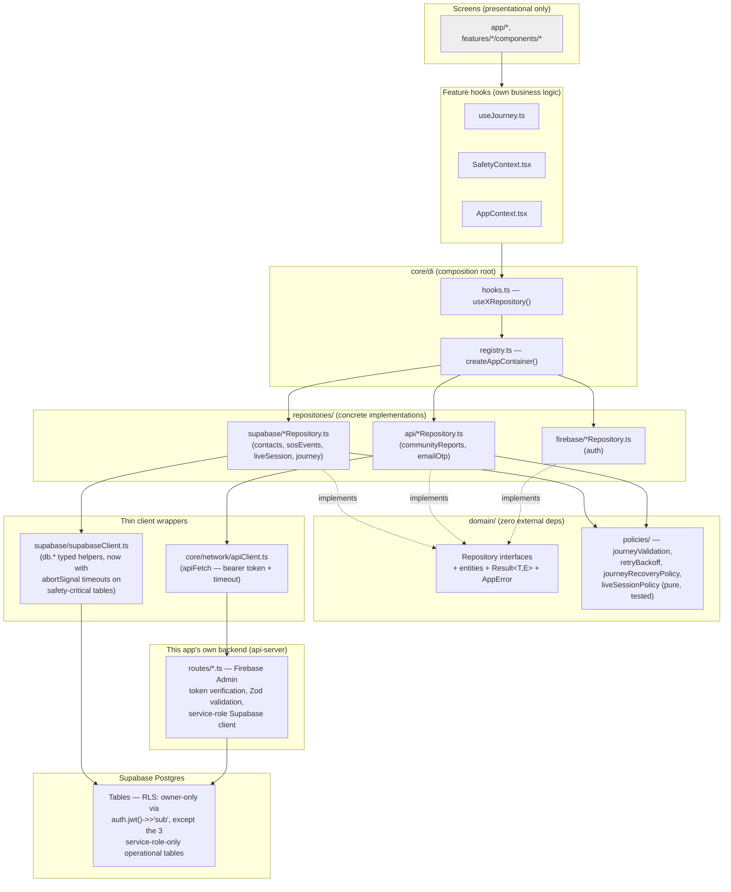

# 2. Repository Flow Diagram

## What's verified vs. what's new in this pass

| Property | Status |
|---|---|
| No direct database access from UI | ✅ verified — every Supabase/`fetch` call lives in `repositories/` or `core/network/`, never in `app/`/`features/*/components/` |
| Repository Pattern maintained | ✅ — every backend-touching capability (contacts, SOS, live sessions, journeys, community reports, email OTP, auth) has a domain interface + concrete implementation, resolved via DI |
| DTO mapping | ✅ — every Supabase-backed repository has a `dto/*Dto.ts` (re-exporting the generated row/insert types) and a `mappers/*Mapper.ts` (row → domain entity), keeping the domain layer free of raw column-name coupling |
| Typed errors / `Result<T,E>` | ✅ — every repository method returns `Result<T, AppError>`, never throws, never returns a bare `null` on failure |
| Timeouts | ⚠️ → ✅ this pass: `core/network/apiClient.ts` already had one; `repositories/supabase/supabaseClient.ts`'s Supabase calls did not. Added `.abortSignal(AbortSignal.timeout(10_000))` to every `sos_events`/`journeys`/`live_sessions` call (the emergency-critical tables) — see the Technical Debt Report for why the remaining tables (profiles, community_reports via backend already has its own; subscriptions; notification_tokens) are a lower-priority follow-up, not an oversight |
| Retry behaviour | ✅ for `journeys` (exponential backoff, idempotent via client UUID) and `sos_events` (client-side interval retry while an SOS is active) — both reviewed and confirmed in prior audits, unchanged here. `contacts`/`liveSessions` mutations are naturally idempotent (upsert-by-id, update-by-id) and don't need a retry loop of their own |
| Atomic operations | ✅ at the single-statement level (every write is one `INSERT`/`UPDATE`/`UPSERT`) — see the Transaction Matrix for the one real gap: multi-table operations (account deletion) that aren't wrapped in a single database transaction |

## The one architectural pattern worth naming explicitly

Two different "backend" paths exist side by side, by design:

1. **Direct-to-Supabase** (contacts, SOS events, live sessions, journeys, subscriptions, notification tokens, profile) — the mobile client authenticates to Supabase with the Firebase ID token via the `accessToken` callback (`supabaseClient.ts`), and RLS enforces ownership. No custom backend involvement for these.
2. **Via this app's own backend** (`api-server`) — SOS alert dispatch (Twilio), community reports, email OTP, Sakhi AI chat, nearby places, RevenueCat webhooks. These need either a secret the client can't hold (Twilio, OpenAI, RevenueCat webhook signing) or server-side-verified-token + service-role-key access that deliberately bypasses RLS (community reports, so a single backend-verified write can't be spoofed by a client forging its own `user_id` via a client-held anon key).

Both paths are legitimate and the split is well-reasoned given what each table actually needs — not an inconsistency to fix.
