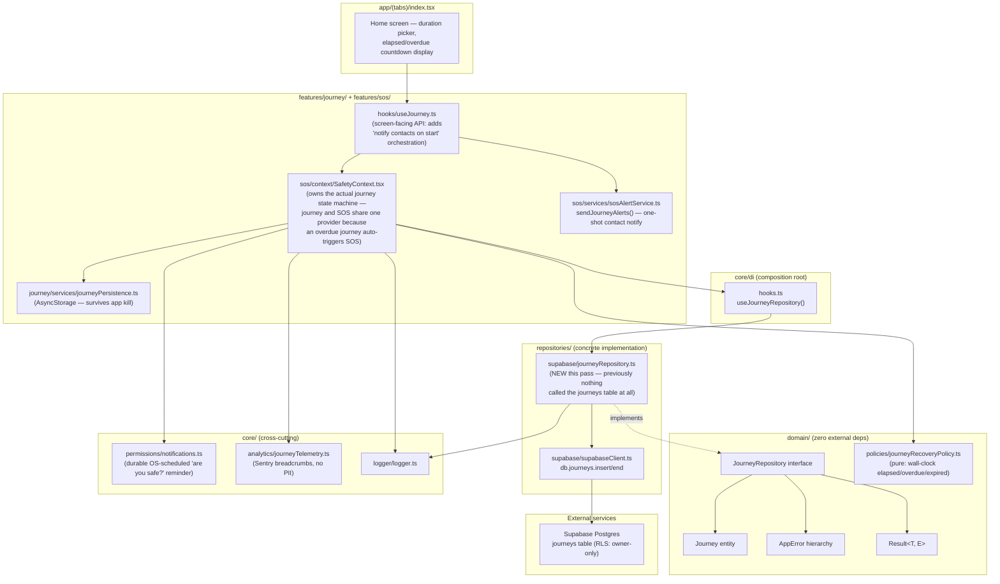

# 1. Journey Tracking Architecture Diagram

## Scope note (read this first)

"Journey Tracking" in this app is a **timed check-in feature**, not continuous GPS route tracking: a user picks a duration, the app notifies their trusted contacts that a journey started, and if the user doesn't check in before the timer (plus a grace period) elapses, it auto-escalates into a real SOS. There is no destination picker, no continuous location breadcrumb trail, and no geofencing today — the `journeys` table's `route_json` column exists in the schema (anticipating breadcrumbs) but nothing populates it. This audit reviews and hardens the feature that actually exists, and explicitly calls out every requested capability that doesn't (geofencing, continuous tracking, adaptive GPS frequency) as a named gap/recommendation rather than fabricating it — see the Reliability Audit and Technical Debt Report.

## Layer rules this diagram enforces

- `domain/` — `JourneyRepository` interface, `Journey` entity, and `domain/policies/journeyRecoveryPolicy.ts` have zero outward dependencies, matching the `domain/policies/liveSessionPolicy.ts` precedent from the SOS audit (repositories must never depend on `features/`, so pure policy logic a repository needs lives in `domain/`, not a feature folder).
- `core/di` is the sole composition-root path from a component to the concrete `journeyRepository` — `useJourneyRepository()`.
- **No new architecture violations introduced.** Journey and SOS continue to share one provider (`SafetyContext`/`SafetyProvider`) — this was already the case before this pass and is not a violation: an overdue journey's entire purpose is to become an SOS, so the coupling is intentional, not accidental.
- **The one real gap this pass closes**: the `journeys` Supabase table and its `db.journeys.insert/end` helper existed before this pass but were **never called by any code** — the journey feature was 100% client-side, ephemeral React state with zero backend persistence and zero repository-pattern wiring. `repositories/supabase/journeyRepository.ts` (new) is the first code to actually use it.
