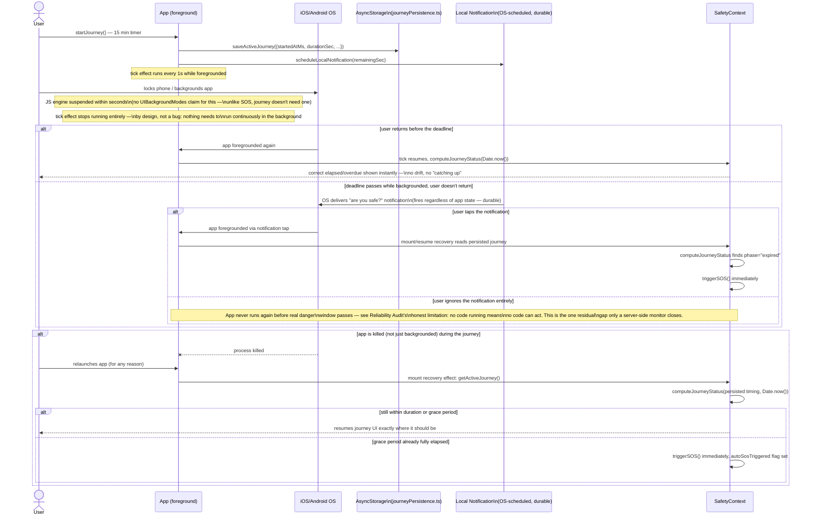

# 3. Background Execution Diagram

## What "background execution" means for this feature today

Journey does not run continuous background location updates (see the Architecture Diagram's scope note) — its only background-execution requirement is: **the overdue/expired check must be correct whenever the app happens to run**, not that it must run continuously. This is a deliberately different (and more achievable) target than SOS's continuous live-tracking requirement, which already has its own `expo-task-manager` background-location infrastructure from the SOS audit.

## iOS limitations acknowledged, not worked around with a false promise

- **No `UIBackgroundModes` claim for journeys.** Requesting a background execution capability (location, in particular) merely to get a periodic "check the wall clock" wake-up would be disproportionate: it means running continuous high-accuracy GPS for the full duration of every check-in journey (which can be hours) just to get a timer tick, with real battery and privacy cost, for a feature that doesn't need continuous location at all. This was considered and deliberately rejected — see the Battery Optimisation Report and Technical Debt Report.
- **Significant Location Change API**: also considered for the same "periodic background wake" purpose. Same rejection: it exists to reduce battery cost of *location tracking*, not to serve as a general-purpose background timer for a feature that has no location-tracking need in the first place. Using a location API to simulate a timer is solving the wrong problem with the wrong tool.
- **BackgroundTasks / `expo-background-fetch`**: opportunistic, OS-scheduled, no minimum-latency guarantee (often 15+ minutes, sometimes much longer, and can be skipped entirely under Low Power Mode or backgrounded-app-usage heuristics) — cannot be relied upon to fire near a specific deadline. Not adopted for the same reason a periodic background wake was rejected for SOS's own background-fetch consideration in the SOS audit: it would give a false sense of a guarantee this API cannot make.
- **What's actually reliable**: (1) the local notification, which the OS itself schedules and delivers regardless of the app's process state — this is the one part of "background execution" for journeys that is already fully durable; (2) the wall-clock recovery check, which guarantees correctness the instant the app runs again for *any* reason (notification tap, user reopening the app, an unrelated push notification bringing it to foreground, a normal relaunch).
- **The honest residual gap**: if the user backgrounds the phone, the deadline passes, and the app is never opened again for any reason before real danger occurs, no client-side mechanism can fire the auto-SOS — there is no code running to do it. This is not a bug to "fix" on the client; it's a fundamental constraint of non-critical-alert background execution on iOS. The correct production fix is a **server-side monitor**: since `journeyRepository.startJourney()` now writes a row to the `journeys` table with `started_at`/`duration_minutes`, a backend job can query for journeys whose deadline has passed with no check-in and trigger the alert authoritatively, independent of the user's device ever running again. This is out of mobile-client scope for this pass (no backend access in this environment) and is the single highest-priority item in the Technical Debt Report.
