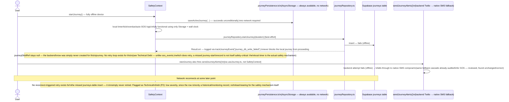

# 4. Offline Sync Diagram

## Scope note

Journey has no continuous location stream, so there is no "offline location queue" of GPS points to design (unlike SOS's live-tracking heartbeat). What *does* need offline-safe handling: (1) the local timer/persistence (must work with zero network at all — it's pure AsyncStorage + wall-clock math), and (2) the one-shot backend record (`journeys` row) and the one-shot "journey started" contact alert, both of which need graceful degradation when offline.

## Guarantee: no *safety-relevant* state is ever lost

| What | Where it lives | Survives offline? | Survives app kill? |
|---|---|---|---|
| Journey timing (`startedAtMs`, `durationSec`, `overdueGraceSec`) | `AsyncStorage` via `journeyPersistence.ts` | ✅ Always — no network dependency at all | ✅ Read back on next launch by the recovery effect |
| Overdue/expired detection | Computed fresh from wall-clock time on every tick and every recovery | ✅ Doesn't require network | ✅ Doesn't require the process to have stayed alive |
| Auto-SOS escalation | `triggerSOS()` — and everything downstream of it (offline queue, DB retry, alert dispatch) already audited and hardened in the SOS pass | ✅ Inherits SOS's own offline-queue/retry guarantees | ✅ Inherits SOS's own crash-recovery guarantees |
| "Journey started" backend record (`journeys` table row) | Supabase, via `journeyRepository` | ❌ Best-effort only, no retry | N/A — not safety-critical, see above |
| "Journey started" contact notification | `sendJourneyAlerts()` (backend Twilio → native SMS fallback) | ✅ Falls back to native SMS compose, matching SOS's already-audited cascade | N/A — one-shot, not something to "recover" mid-flight |

## Duplicate-journey / conflict prevention

There is exactly one persisted-journey slot (`ACTIVE_JOURNEY_KEY`, a single AsyncStorage key, not a list) — starting a new journey while one is already persisted simply overwrites it, matching the existing (pre-this-pass) UX where the duration-picker UI is hidden while a journey is active, so a genuine double-start isn't reachable through normal navigation. No duplicate-row risk exists on the backend side either, since each `startJourney()` call performs exactly one `insert` (no retry loop that could double-insert, unlike `sos_events`'s retry-driven dedup concern) — the trade-off being that a failed insert is simply never retried (see above), not that it risks a duplicate.
