# 2. Journey State Machine

`JourneyState` (`features/sos/types.ts`) is unchanged in shape by this pass — `active`, `seconds`, `duration`, `overdue`, `overdueSeconds` — preserving every existing UI binding (`app/(tabs)/index.tsx` renders all five fields directly). What changed is how these values are *computed*: from wall-clock time via `domain/policies/journeyRecoveryPolicy.ts`, not from an incrementally-updated counter. See the Reliability Audit for why that distinction is the single most important fix in this pass.

```mermaid
stateDiagram-v2
    [*] --> Idle

    Idle --> Active: startJourney()\n(persists startedAtMs locally +\nbest-effort Supabase journeys row;\nnotifies contacts once)

    Active --> Idle: checkInJourney() / endJourney()\n("I'm Safe" / manual end —\nclears local + backend record)

    state Active {
        [*] --> WithinDuration
        WithinDuration --> WithinDuration: tick (1s): recompute elapsed\nfrom wall clock — seconds shown\nto the user always matches\nDate.now() - startedAtMs,\nnever an independently-drifting counter
        WithinDuration --> Overdue: elapsed >= duration\n(computeJourneyStatus phase: "overdue")
        Overdue --> Overdue: tick (1s): grace-period\ncountdown, also wall-clock-derived
        Overdue --> Expired: grace period fully elapses\n(computeJourneyStatus phase: "expired")
        Expired --> [*]: triggerSOS() — journey state\nstays "overdue" underneath;\nthe SOS bottom sheet takes over\nthe screen (same as a manual SOS)
    }

    Idle --> Active: crash/background recovery on mount\n(persisted journey found, not expired)
    Idle --> Expired: crash/background recovery on mount\n(persisted journey found, already expired —\nauto-SOS fires immediately, no waiting\nfor "the ticks that should have happened")

    note right of Active
        journeyStartedAtMsRef anchors every
        computation. Whether the tick runs
        every second (foreground), resumes
        after a gap (backgrounded then
        foregrounded again), or the app was
        fully killed and relaunched, the very
        next evaluation of computeJourneyStatus
        against Date.now() is always correct —
        there is no "catching up" logic because
        there's nothing to catch up: the status
        was never actually wrong, only unobserved.
    end note
```

## Deterministic transitions — verified

| Transition | Guard | Verified |
|---|---|---|
| Idle → Active | `startJourney()` always sets `active:true` unconditionally — there is no "already active" guard | ✅ Matches original behavior (starting a new journey while one is active simply overwrites it — a deliberate, pre-existing UX choice not touched by this pass; the UI already hides the duration-picker while `journey.active`, so a double-start isn't reachable through normal navigation) |
| Active → Overdue | `computeJourneyStatus`'s pure boundary: `elapsedSec >= durationSec` | ✅ Unit-tested (`journeyRecoveryPolicy.test.ts`) at the exact boundary |
| Overdue → Expired | `overdueElapsedSec >= overdueGraceSec` | ✅ Unit-tested at the exact boundary |
| Expired → SOS | Guarded by `journeyAutoSosFiredRef` (in-memory) and `autoSosTriggered` (persisted) — fires at most once per journey | ✅ Both the live-tick path and the recovery path check this flag before calling `triggerSOS()` |
| Active/Overdue → Idle | `checkInJourney()` / `endJourney()` — both route through the same `endJourneyRecord()` helper, which clears local persistence, clears the wall-clock anchor, resets the guard refs, and ends the Supabase record best-effort | ✅ Single code path for both entry points — no way to end a journey without going through the same cleanup |
| Idle → Active (recovery, not expired) | Mount effect finds a persisted journey; `computeJourneyStatus` says `active` or `overdue` | ✅ Resumes into the exact matching UI state (including which countdown to show) rather than restarting from zero |
| Idle → Expired (recovery, already expired) | Mount effect finds a persisted journey; `computeJourneyStatus` says `expired` | ✅ Escalates to SOS immediately, guarded against re-firing via the persisted `autoSosTriggered` flag surviving across even a second recovery pass (e.g. a crash during the recovery effect itself) |

## No invalid transitions possible

There is no code path that can produce, for example, `overdue:true` while `active:false`, or a negative `overdueSeconds`/`seconds` — every value is derived in one place (`computeJourneyStatus`) from a `Math.max(0, ...)`-clamped elapsed calculation, then mapped into the `JourneyState` shape at the two call sites (the live tick and the recovery effect), both reviewed in this pass.

## v2 hardening pass: explicit terminal outcomes (`domain/entities/JourneyOutcome.ts`)

The diagram above still shows `Expired --> [*]` as a single transition, but as of the v2 pass this is now one of two distinct, explicitly-recorded outcomes rather than an implicit "it ended somehow":

- **"escalated"** — the grace period expired *and* `triggerSOS()` actually fired (`sos.phase` was `"idle"` at that instant).
- **"expired"** — the grace period fully elapsed but `triggerSOS()`'s own internal guard blocked it (an unrelated SOS was already active) — a real, distinct, non-silent outcome now, not merged into "escalated."

Both `"completed"` (via `checkInJourney()`) and `"cancelled"` (via `endJourney()`) are recorded the same explicit way, replacing the previous implicit model where "ended" meant only "state was cleared, no record of why." Every outcome, plus `escalationReason` (`"grace_period_elapsed"` | `"sos_blocked_by_existing_emergency"`) where applicable, is written to the persisted journey record (`journeyPersistence.ts`) immediately before it's cleared, and to telemetry via `core/analytics/journeyTelemetry.ts`'s corresponding event (`journey_completed`/`journey_cancelled`/`journey_escalated`/`journey_expired`).

"Recovered" is deliberately **not** a 5th outcome value — see `JourneyOutcome.ts`'s file header for why forcing it into the same field as "why did it end" would be self-contradictory. It's tracked as a separate dimension instead: `wasRecoveredFromBackground` on the persisted record, and a distinct `journey_recovery` telemetry event (with a `recoveryOutcome: "resumed" | "expired"` field) — answering "was this determined by the crash/background recovery path, or live?" independently of which of the four real outcomes it turned out to be.

Every journey also now carries a client-generated, stable `journeyId` (UUID, via `expo-crypto`'s `Crypto.randomUUID()`) — set once in `startJourney()`, persisted locally, and used as the backend `journeys` row's primary key. See `docs/journey-audit/hardening-v2-report.md` for the full rationale and `repositories/supabase/journeyRepository.ts` for how this makes journey creation genuinely idempotent under retry.
