# 1. SOS / Emergency Subsystem Architecture Diagram

```mermaid
graph TD
    subgraph UI["app/ + shared UI"]
        Tab["(root) tab bar / any screen\n(SOS button, shake gesture)"]
        SosSheet["SosBottomSheet.tsx\n(presentational only — no side effects)"]
    end

    subgraph Features["features/sos/"]
        SafetyCtx["SafetyContext.tsx\n(the SOS + journey state machine —\nowns triggerSOS/cancelSOS, alert dispatch,\nDB write+retry, crash recovery)"]
        ShakeHook["hooks/useShakeDetector.ts"]
        AlertSvc["services/sosAlertService.ts\n(backend Twilio + native SMS/call fallback)"]
        OfflineQueue["services/sosOfflineQueue.ts\n(persisted pending-activation record)"]
        RecoveryPolicy["services/sosRecoveryPolicy.ts\n(pure: stale-activation cutoff)"]
        EmergencyMsg["utils/emergencyMessage.ts\n(pure, localized message builder)"]
    end

    subgraph DI["core/di (composition root)"]
        Hooks["hooks.ts\nuseSosEventsRepository / useLiveSessionRepository"]
    end

    subgraph Domain["domain/ (zero external deps)"]
        SosRepoIface["SosEventsRepository interface"]
        LiveRepoIface["LiveSessionRepository interface"]
        SosEntity["SosEvent / LiveSession entities"]
        LivePolicy["policies/liveSessionPolicy.ts\n(pure: heartbeat/expiry window)"]
        Errors["AppError hierarchy"]
        ResultType["Result&lt;T, E&gt;"]
    end

    subgraph Repos["repositories/ (concrete implementations)"]
        SosRepo["supabase/sosEventsRepository.ts"]
        LiveRepo["supabase/liveSessionRepository.ts\n(zombie cleanup + heartbeat expiry)"]
        SupaClient["supabase/supabaseClient.ts\n(db.sosEvents / db.liveSessions)"]
    end

    subgraph CoreInfra["core/ (cross-cutting)"]
        BgLocation["permissions/backgroundLocation.ts\n(TaskManager task, module-load-registered)"]
        Location["permissions/location.ts\n(foreground fix + reverse geocode)"]
        Notifications["permissions/notifications.ts\n(local + push token lifecycle)"]
        SosTelemetry["analytics/sosTelemetry.ts\n(Sentry breadcrumbs, no PII)"]
        Logger["logger/logger.ts"]
        ApiClient["network/apiClient.ts"]
    end

    subgraph External["External services"]
        SupabaseDB["Supabase Postgres\nsos_events / live_sessions\n(RLS: owner-only)"]
        Backend["api-server: POST /sos/alert\n(Twilio, idempotency cache, rate limit)"]
        OS["iOS/Android OS\nbackground location delivery,\nAPNs / FCM push"]
    end

    Tab --> SafetyCtx
    SafetyCtx --> ShakeHook
    SafetyCtx --> SosSheet
    SafetyCtx --> AlertSvc
    SafetyCtx --> OfflineQueue
    SafetyCtx --> RecoveryPolicy
    SafetyCtx --> Location
    SafetyCtx --> BgLocation
    SafetyCtx --> Notifications
    SafetyCtx --> SosTelemetry
    SafetyCtx --> Hooks
    AlertSvc --> EmergencyMsg
    AlertSvc --> ApiClient
    ApiClient --> Backend

    Hooks --> SosRepo
    Hooks --> LiveRepo
    SosRepo -.implements.-> SosRepoIface
    LiveRepo -.implements.-> LiveRepoIface
    SosRepoIface --> ResultType
    SosRepoIface --> Errors
    LiveRepoIface --> ResultType
    LiveRepoIface --> Errors
    SosRepoIface --> SosEntity
    LiveRepoIface --> SosEntity

    LiveRepo --> LivePolicy
    SosRepo --> SupaClient
    LiveRepo --> SupaClient
    SupaClient --> SupabaseDB

    BgLocation --> LiveRepo
    BgLocation --> OS
    Notifications --> OS

    SafetyCtx --> Logger
    SosRepo --> Logger
    LiveRepo --> Logger
    BgLocation --> Logger
```

## Layer rules this diagram enforces (checked by ESLint's `import/no-restricted-paths`, mirroring ADR 0001)

- `domain/` — `SosEventsRepository`/`LiveSessionRepository` interfaces, `SosEvent`/`LiveSession` entities, and `domain/policies/liveSessionPolicy.ts` have zero outward dependencies. The heartbeat/expiry policy lives here (not in `features/sos/services/`, where the SOS-specific pure logic lives) specifically because `repositories/supabase/liveSessionRepository.ts` needs it, and repositories must never depend on `features/` — that would invert the dependency direction the whole layering exists to enforce.
- `core/di` is the one composition-root place allowed to import concrete repository implementations for use by React components (`useSosEventsRepository`, `useLiveSessionRepository`).
- **One documented exception**: `core/permissions/backgroundLocation.ts` imports `repositories/supabase/liveSessionRepository.ts` directly (inline `eslint-disable` comment, same pattern as `core/network/apiClient.ts` and `core/permissions/notifications.ts`). This is necessary, not incidental: the background location `TaskManager` task can be invoked by the OS in a headless JS context with no React tree mounted at all (e.g. iOS relaunching the app purely to deliver a location update while the app was killed), so there is no component present to resolve the repository through the DI hook. This is the same "no domain-level indirection yet for non-component background work" carve-out used for push-token registration in the auth-hardening pass.
- **SosBottomSheet is purely presentational.** Before this pass it ran its own `sendSosAlerts` effect and owned `alertStatuses`/`alertSending` state — a presentational component driving the actual emergency-delivery side effect. That state and the dispatch call now live in `SafetyContext` (see the SOS flow review and technical debt report for why this was a real defect, not stylistic).
- The backend (`api-server/src/routes/sos-alert.ts`) is out of mobile-client scope for this pass — reviewed, found to already implement idempotency-key deduplication and rate limiting, and left unmodified.
