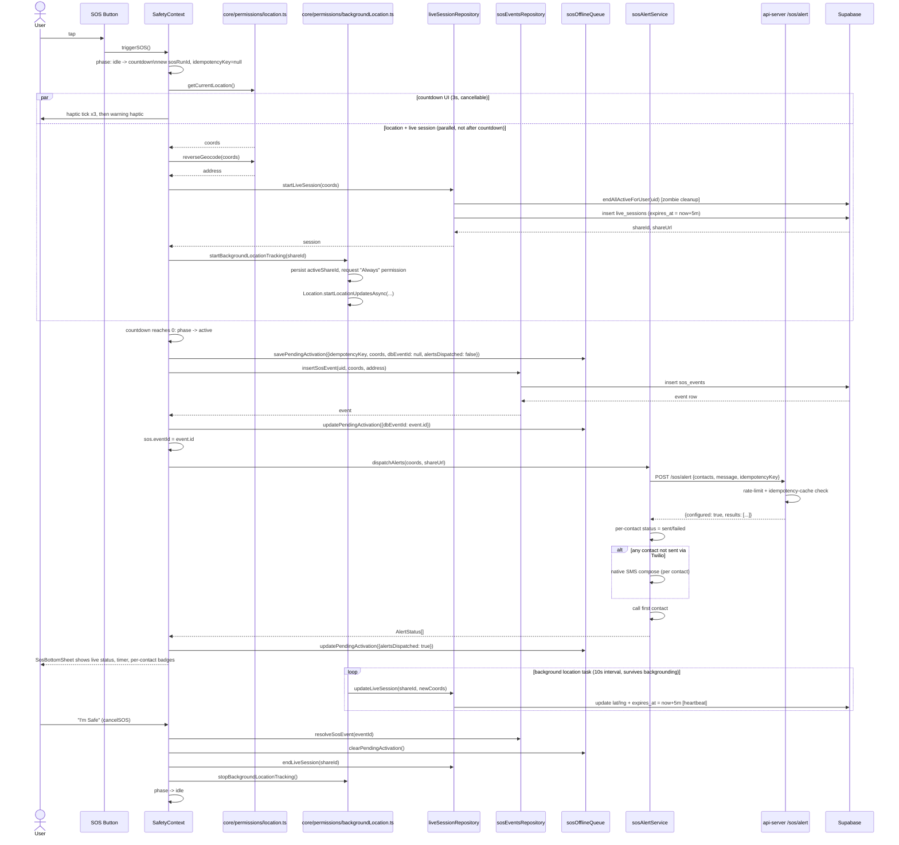

# 3. Emergency (SOS) Sequence Diagram

Happy path — manual trigger, backend Twilio available, live tracking succeeds:



## Degraded-path sequence — DB write fails, app is killed, then relaunched

```mermaid
sequenceDiagram
    actor User
    participant Ctx as SafetyContext
    participant Queue as sosOfflineQueue
    participant SosRepo as sosEventsRepository
    participant OS as OS (process kill)
    participant Boot as app cold start

    User->>Ctx: triggerSOS() -> countdown -> active
    Ctx->>Queue: savePendingActivation(idempotencyKey, coords, dbEventId: null)
    Ctx->>SosRepo: insertSosEvent(...)
    SosRepo--xCtx: network error
    Note over Ctx: sos.eventId stays null;\n15s retry timer starts
    OS--xCtx: process killed (low memory / user swipe / crash)

    Boot->>Ctx: SafetyProvider mounts
    Ctx->>Queue: getPendingActivation()
    Queue-->>Ctx: {idempotencyKey, coords, dbEventId: null, triggeredAtMs}
    Ctx->>Ctx: isPendingActivationStale(triggeredAtMs, now)?
    alt under 30 minutes old
        Ctx->>Ctx: resume full "active" UI\n(reuse idempotencyKey, alertsDispatched flag)
        Ctx->>Ctx: fetchLocationAndStartTracking (fresh live session\n— prior share id not recoverable)
        Note over Ctx: the still-active retry-effect-equivalent\n(insertOrAdopt) fires again once phase=active\nand eventId=null, deduped via\nfindRecentUnresolvedEvent
    else 30+ minutes old
        Ctx->>SosRepo: findRecentUnresolvedEvent(uid, since)\n then insertSosEvent if none found
        Note over Ctx: reconciled silently in the background —\nUI stays at idle, no surprising stale\n"SOS active" screen for a resolved emergency
    end
```
