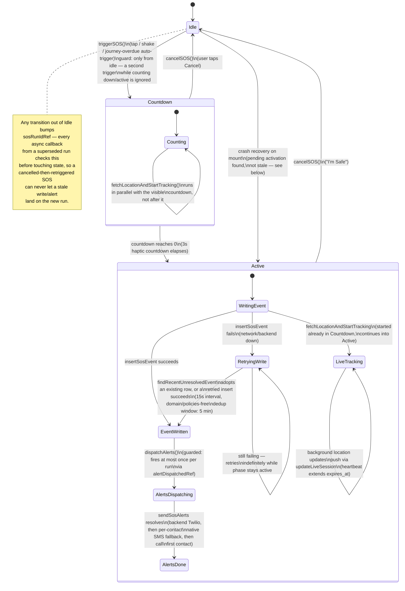

# 2. SOS State Machine

`SosState.phase` (`features/sos/types.ts`) has three values: `"idle" | "countdown" | "active"`. Everything else in `SafetyContext.tsx` — DB writes, alert dispatch, live tracking, crash recovery — is driven off transitions between these three phases plus a small set of derived flags (`eventId`, `coords`, `shareUrl`).

## What drives each transition

| Trigger | Source | Guard |
|---|---|---|
| `triggerSOS()` | SOS button tap, shake detector (opt-in), journey-overdue auto-escalation | `sos.phase !== "idle"` — a second call while counting down or active is a silent no-op |
| Countdown → Active | `setInterval` in `SafetyContext`, 1s tick, `COUNTDOWN_START = 3` | Countdown haptic fires on every tick; final tick fires a distinct "warning" haptic |
| `cancelSOS()` | Cancel button (countdown), "I'm Safe" button (active) | Resolves the DB event (if written), clears the offline-queue record, stops live tracking |
| Active → Idle via completion | Not automatic — an active SOS stays active until the user cancels. There is no auto-timeout; this is intentional (see Reliability Audit — auto-clearing an unacknowledged emergency would be the worse failure mode) | — |
| Crash-recovery resume | Mount-time effect reads `sosOfflineQueue.getPendingActivation()` | Only resumes the full "active" UI if `isPendingActivationStale()` says the activation is under 30 minutes old; otherwise reconciles the DB record silently and leaves the UI at idle |

## Sub-flows within the `active` phase

1. **Location capture** (`fetchLocationAndStartTracking`, started at the moment of trigger, not after the countdown) — one-shot `getCurrentLocation()` + `reverseGeocode()`, both best-effort (a failure leaves `coords`/`address` null but does not block the rest of the flow).
2. **Live session + background tracking** — `liveSessionRepository.startLiveSession()` creates the Supabase row (closing any zombie sessions from a prior crash first — see Reliability Audit §6), then `startBackgroundLocationTracking()` registers the OS-level background location task so updates keep flowing after the app is backgrounded.
3. **DB event write with automatic retry** — `insertOrAdopt()` either inserts a new `sos_events` row or, on retry, checks for one it may have already written (response lost, not the write) before inserting again. A 15s-interval effect keeps retrying for as long as `sos.phase === "active" && sos.eventId === null`.
4. **Alert dispatch** — `dispatchAlerts()`, guarded by `alertDispatchedRef` so it runs at most once per run. Delegates to `sosAlertService.sendSosAlerts()` (backend Twilio with one bounded retry, then per-contact native SMS fallback, then a call to the first contact).
5. **Offline-queue persistence** — every state change worth surviving a crash (`idempotencyKey`, coords, `dbEventId`, `alertsDispatched`) is written to `sosOfflineQueue` as it becomes known, not batched at the end.

## Journey (check-in timer) state machine — feeds into SOS

`JourneyState` (`active`, `overdue`, `overdueSeconds`) is a separate, simpler machine that terminates in an **auto-`triggerSOS()` call** if the user doesn't check in within `OVERDUE_GRACE_SEC` (60s) after the journey timer elapses. This is the "journey escalation" path named in the audit brief's section 6/13 — it reuses the exact same `triggerSOS()` entry point as a manual tap, so every reliability property documented above (retry, offline queue, crash recovery) applies identically to an auto-escalated SOS.
