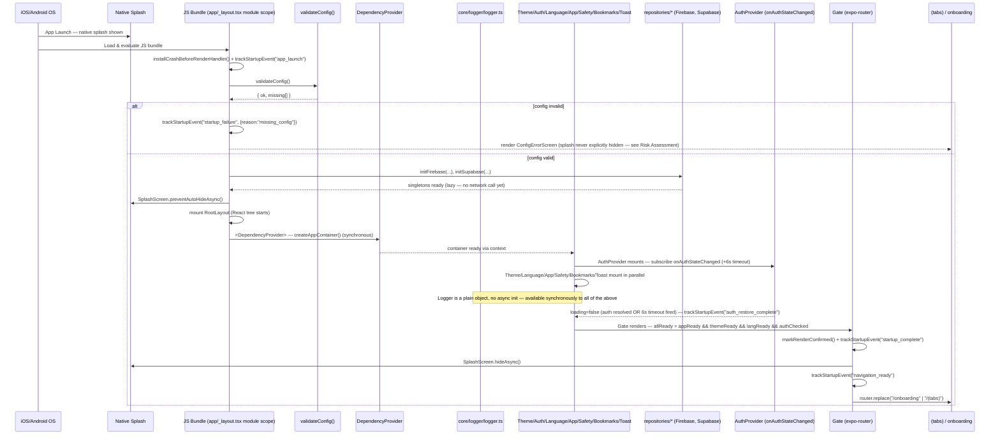

# 1. Startup Sequence Diagram

## Where startup can fail (measured against this diagram)

| Stage | Failure mode | Current mitigation |
|---|---|---|
| JS Bundle evaluation | Unconditional import of an optional native module throws synchronously (the expo-task-manager/Expo Go incident) | Fixed: `core/capabilities/nativeCapabilities.ts` — see Section 4. `installCrashBeforeRenderHandler()` now also catches any *future* mistake of this shape in this exact window |
| Config validation | Missing required env var | `validateConfig()` returns `{ok:false}`; `RootLayout` renders `ConfigErrorScreen` instead of crashing. **Known gap**: splash is never explicitly hidden on this path — see Risk Assessment R-1 |
| DI container creation | `createAppContainer()` throws during repository registration | Synchronous, in `useMemo` — an uncaught throw here would be caught by the `ErrorBoundary` that wraps `DependencyProvider` (confirmed: `ErrorBoundary` sits **above** `DependencyProvider` in the tree) |
| AuthProvider | `onFirebaseAuthStateChanged` never fires (dead network, broken persistence read) | 6-second timeout forces `loading=false` regardless — confirmed unconditional, always resolves |
| Font loading | Google Fonts fetch stalls (Expo Go dev mode, fetched over the network) | 4-second timeout renders with system fonts instead |
| Navigation | `Gate` never renders `<RootLayoutNav>` | Only possible if `allReady` never becomes `true` — traced to each of its 4 inputs above, all of which have a bounded resolution path |
